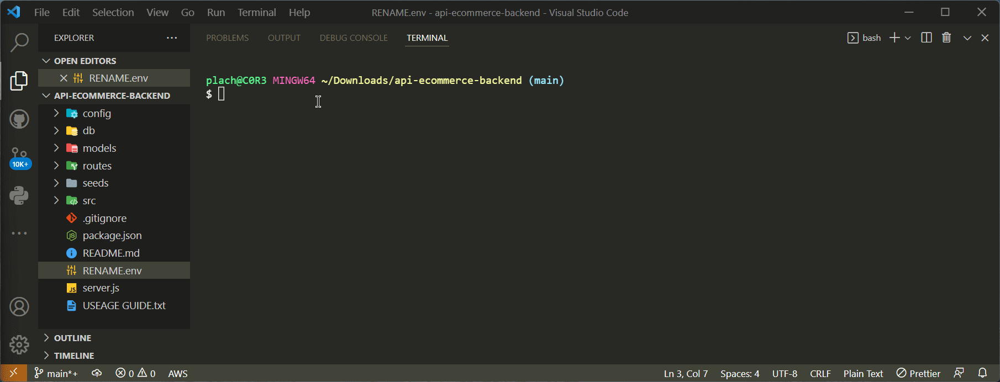
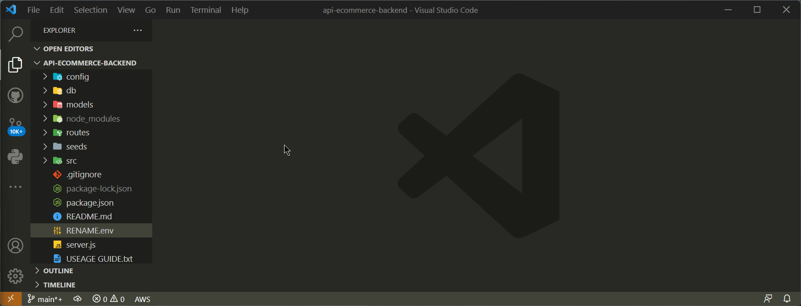
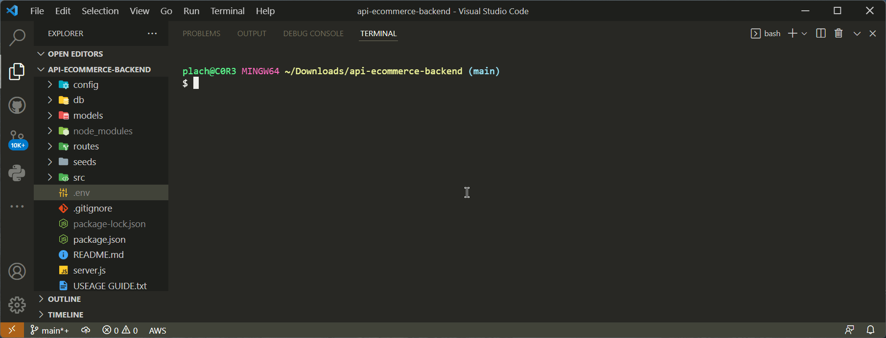
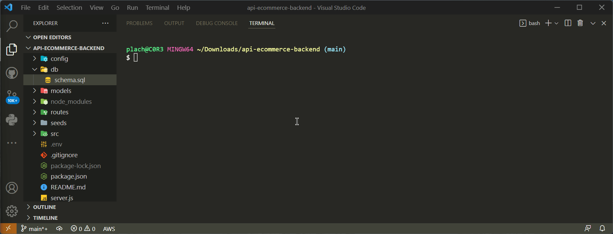
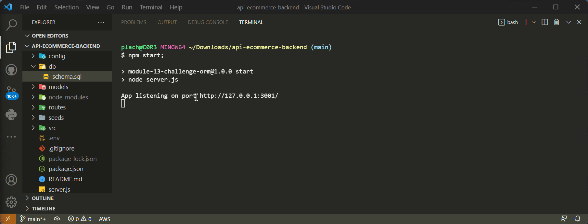
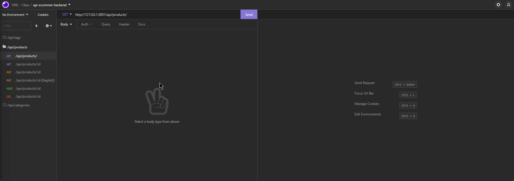

# API E-Commerce Back End API

## This Concept APP demonstrates how you can use an ORM to communicate between an Express.js server and MySQL Database.

---

## Index

- [Concept](#concept)
- [Repo Stats](#repo-stats)
- [Requirements](#requirements)
- [Usage](#usage)
- [Contributors](#contributors)
[Questions?](#questions)

---

### Concept

**Build the back end for an e-commerce site.**

Internet retail, also known as e-commerce, is the largest sector of the
electronics industry, having generated an estimated US$29 trillion in 2017
>> *(Source: United Nations Conference on Trade and Development).*

> E-commerce platforms like Shopify and WooCommerce provide a suite of services
> to businesses of all sizes. Due to the prevalence of these platforms,
> developers should understand the fundamental architecture of e-commerce sites.


---

## Repo Stats

[](https://github.com/ErikPlachta/api-ecommerce-backend)

[](https://github.com/ErikPlachta/api-ecommerce-backend)
[](https://github.com/ErikPlachta/api-ecommerce-backend)

[](https://github.com/ErikPlachta/api-ecommerce-backend/issues)


---

## Requirements

- MySQL ( *This guide assumes you already have MySQL setup and a username + password* )
- Node.js ( *This guide assumes you've got Node.js installed and setup* )
- Program to Manage API Calling ( *This guide assumes you have an app to make API calls* )

### Dependencies

- [Express]() is used to run your local API Server via node.js.
- [MySQL2](https://www.npmjs.com/package/mysql2) and [Sequelize](https://www.npmjs.com/package/sequelize) are used to
 connect your Express.js API to a MySQL database.
- [dotenv](https://www.npmjs.com/package/dotenv) is used to give access to the `.env` file, which contains environment
 variables that store sensitive data, like your MySQL username, password, and database name.


### Dev Dependencies

- [nodemon] is used for...

---

---

## Usage

[**Here** is a LINK to a full video](./src/api-ecommerce-backend_Useage_FULL.mp4),
demonstrating how to use this APP.

**Below are the steps broken down into segments with the same information.**

1. [Download The App](#1-download-the-app)
2. [Initialize the App](#2-initialize-the-app)
3. [Update the RENAME.env File](#3-update-env-with-your-mysql-username-and-password)
4. [Create Local MySQL Database](#4-create-local-mysql-database)
5. [Seed your Database](#5-seed-your-database)
6. [Start your Local Server](#6-start-your-local-server)
7. [Use API to Manage the Database](#7-use-api-to-manage-the-database)

---

### 1. Download The App

> First, you'll need to downlaod the APP locally.

- [Download Link](https://github.com/ErikPlachta/api-ecommerce-backend/archive/refs/heads/main.zip)

---

### 2. Initialize the App

> Next, you'll need to install the local dependencies.

```bash
npm i
```



---

### 3. Update .env with your MySQL Username and Password

> Rename the file `RENAME.env` to `.env`, and update the Username and Password
> with your MySQL login information.

```env
DB_NAME=ecommerce_db
DB_USER=your-username
DB_PW=your-password
```



---

### 4. Create Local MySQL Database

> Use the `schema.sql` file in the `./db` folder to create your database using
> the following MySQL shell Commands.

```bash
mysql -u username -p < db/schema.sql
Enter Password:
```



---

### 5. Seed your Database

> Run the below script to fill the database with SEED data and complete the
> table building with the MySQL Database `ecommerce_db`.

```bash
npm run seed
```


---

### 6. Start your Local Server

> Now that everything is setup, you'll need to start your local Express.js
> server.

```bash
npm start
```



---

### 7. Use API to Manage the Database

> Lastly, use the API to manage the database.

**Example: Basic API Call Setup through Insomnia**



**Example: Full Demonstration of how to mange data with API through Insomnia**



---

---

## Contributors

### [Erik Plachta](https://github.com/ErikPlachta)

### [Xander](https://github.com/Xandromus)

- Build the source code for the project, [here](https://github.com/coding-boot-camp/fantastic-umbrella)

## Questions?

> Feel free to contact me on my [twitter @ErikPlachta](http://www.twitter.com/erikplachta)